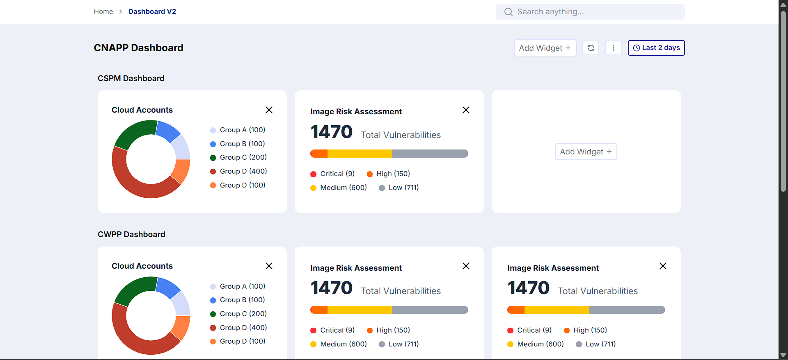
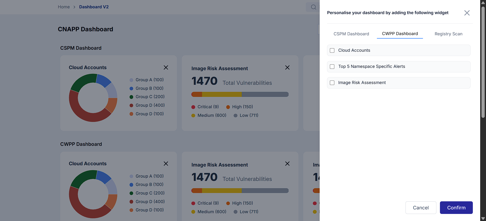

# Frontend Trainee Assignment – Dashboard App




This is a **React + Vite** based dashboard project.  
The app allows users to add/remove widgets dynamically into different dashboard sections using a side drawer.

---

## 🚀 Features
- Built with **React + Vite** for fast development.
- **Redux Toolkit** for state management.
- Dynamic sections and widgets loaded from JSON config.
- Side drawer to select and add widgets to specific sections.
- Responsive layout using **TailwindCSS**.
- Example widgets:
  - Donut/Chart widget
  - Registry Scan widget

---

## 📦 Getting Started

### 1. Clone the Repository
```bash
git clone <your-repo-url>

### 2. Navigate to Project Directory
```bash
cd <your-project-folder>